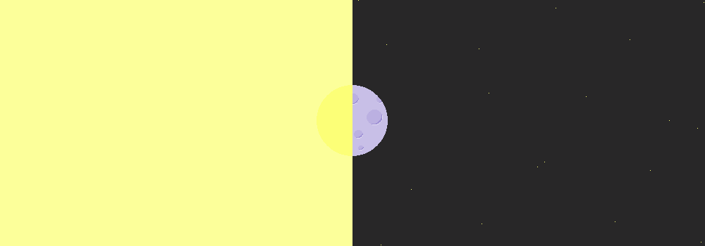
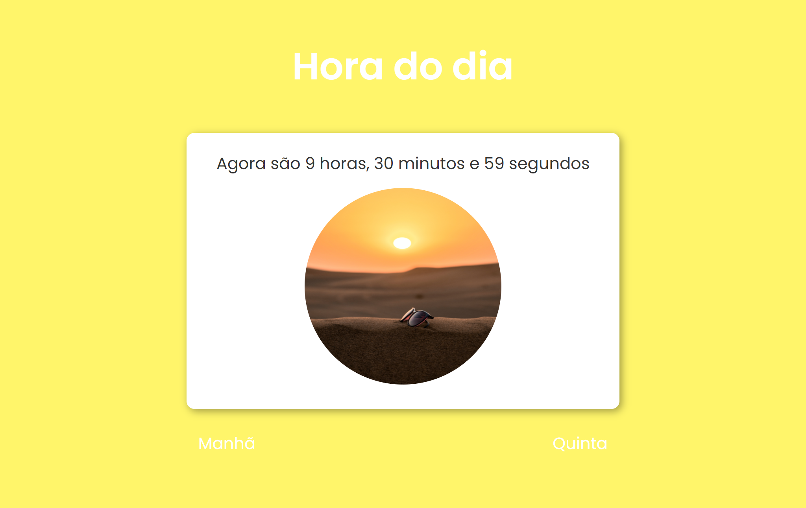
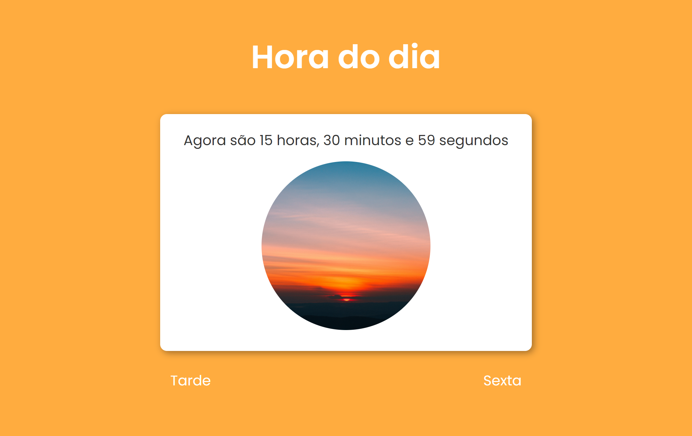
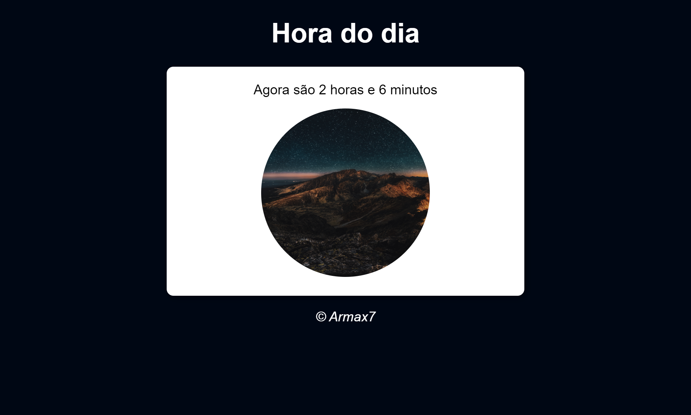
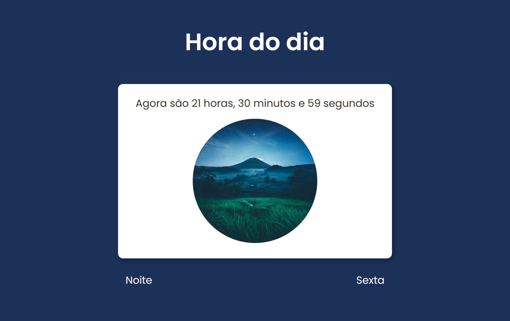
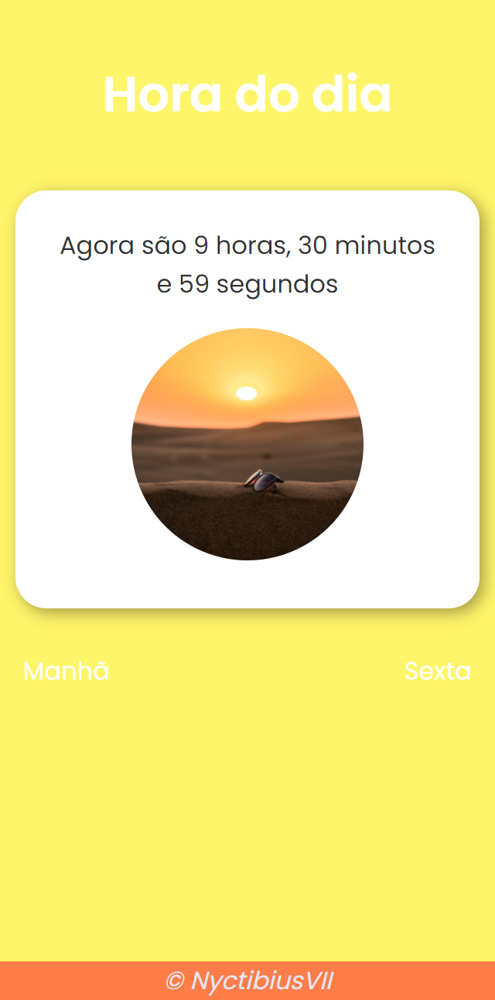

<h1 align="center">
  
</h1>

<p align="center">
  
  
  <a href="https://github.com/NyctibiusVII/DiaNoiteJS/blob/master/LICENSE">
    
  </a>
  <a href="https://picpay.me/Matheus_nyctibius_vii">
    
  </a>
</p>

<p align="center">
  <a href="#dianoite-">Projeto</a>                   &nbsp;&nbsp;&nbsp;|&nbsp;&nbsp;&nbsp;
  <a href="#visual-">Visual</a>                      &nbsp;&nbsp;&nbsp;|&nbsp;&nbsp;&nbsp;
  <a href="#rodando-o-projeto-%EF%B8%8F">Executar</a>&nbsp;&nbsp;&nbsp;|&nbsp;&nbsp;&nbsp;
  <a href="#licença-%EF%B8%8F">Licença</a>
</p>

# Dia/Noite 🌞🌚
O projeto foi ensinado por [Gustavo Guanabara](https://github.com/professorguanabara) com o intuito de aprender mais sobre algumas funcionalidades do javascript/iniciante.

O back-end atualiza a cada 1 hora pegando o seu tempo atual e dependendo do horário (Manha, Tarde, Noite ou Madrugada) seta uma imagem base(cinza) para outra condizente com seu tempo.

###### Ex:
``` bash
# Seu horário é 17:30
# Então ira aparecer uma imagem relacionada ao entardecer
```

## Visual ✨
|  |  |
| :---: | :---: |
|  |  |

|  |  |
|:---:|:---:|

## Rodando o projeto 🚴🏻‍♂️
``` bash
# Clone o repositório
$ git clone https://github.com/NyctibiusVII/DiaNoiteJS.git

# Abra o index.html com seu navegador
- abra o explorer no arquivo
- Clique com o botão direito no arquivo
- Clique em 'Abrir com...' e selecione seu navegador

# O documento atualiza a cada 1 hora já pegando os minutos passados
```

## Próximos passos 🚶🏻‍♂️
- Imagens -> adicionar mais imagens, ideal ( 1 img p/ cada hora)
- Background -> fazer a transição de cores conforme o horario do dia.
###### Ex:
``` bash
# Agora é 17:30
# Então em tese será uma transição do entardecer ao anoitecer
```

## Licença ⚖️
Esse projeto está sob a licença MIT. Veja o arquivo [LICENSE](https://github.com/NyctibiusVII/DiaNoiteJS/blob/master/LICENSE) para mais detalhes.

## Contato ✉️
| <br><sub><a href="https://www.instagram.com/nyctibius_vii/?hl=pt-br">@MatheusVidigal🦊</a></sub> |
| :---: |

<p align="left">
  <a href="https://www.linkedin.com/in/matheus-vidigal-nyctibiusvii/">
      
  </a>
  <a href="https://mail.google.com/mail/u/1/#inbox?compose=GTvVlcSGLCKpKJfwPsKKqzXBplKkGtCLvCQcFWdWxCxQFfkHzzjVkgzrMFPBgKBmWFHvrjrCsMqSH">
      
  </a>
</p>


<!--
<div style="display:flex; align-items:center;">

  <div>

  | <br><sub><a href="https://www.instagram.com/nyctibius_vii/?hl=pt-br">@MatheusVidigal🦊</a></sub> |
  | :---: |
  </div>

  <div style="margin: 100px 0px 0px 20px;">
    <p align="left">
      <a href="https://www.linkedin.com/in/matheus-vidigal-nyctibiusvii/">
          
      </a>
      <br>
      <a href="https://mail.google.com/mail/u/1/#inbox?compose=GTvVlcSGLCKpKJfwPsKKqzXBplKkGtCLvCQcFWdWxCxQFfkHzzjVkgzrMFPBgKBmWFHvrjrCsMqSH">
          
      </a>
    </p>
  </div>
</div>
-->